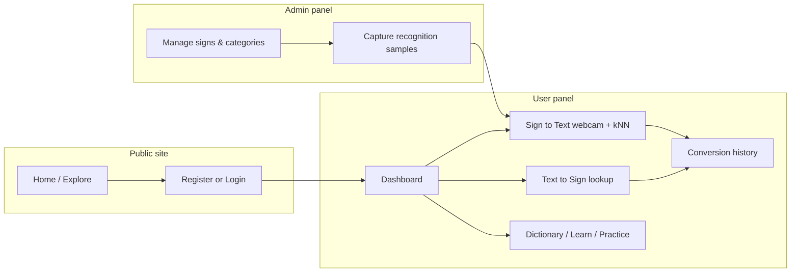

# SignBridge

**SignBridge** is a full-stack web application that bridges written text and sign language for learning and daily communication. Users can look up sign visuals from text, practice signs with a webcam, browse a categorized dictionary, and keep a personal conversion history. Administrators manage the sign dictionary, recognition training data, users, feedback, and platform branding.

---

## Project Overview

### What it does

SignBridge provides two primary conversion flows:

1. **Text → Sign** — Users enter a word or phrase; the app looks up an active dictionary entry and displays sign media (image/SVG).
2. **Sign → Text** — Users perform a sign in front of the webcam; **MediaPipe Hand Landmarker** extracts hand landmarks in the browser, and a **k-nearest neighbors (kNN)** classifier matches them against training samples stored in MongoDB.

Supporting features include categories, favorites, guided learning, practice quizzes, conversion history, user feedback with admin workflow, and a public marketing site.

### Purpose

The system is designed for schools, NGOs, and families who need an accessible dictionary and lightweight recognition tooling without relying on paid third-party translation APIs. It is suitable as a MERN portfolio or pilot deployment with clear admin control over content and recognition quality.

### Main users and roles

| Role | Description |
|------|-------------|
| **Guest (public)** | Browse marketing pages and explore public sign listings without logging in. |
| **User** | Register, convert text/sign, use dictionary and learning tools, manage profile and history. |
| **Admin** | Full control center: users, dictionary, recognition samples, practice pool, conversions, feedback, settings. |

There are no additional roles (no vendor, staff, or teacher panels).

### Core workflow



1. Admin maintains **categories**, **signs** (with media uploads), and **recognition samples** (webcam capture or seed data).
2. User loads the recognition dataset in the browser and performs signs; stable predictions are saved as **conversions**.
3. User searches text for dictionary matches; successful lookups are also logged as conversions.
4. Admin monitors **users**, **conversions**, and **feedback** from the dashboard and list modules.

### Major capabilities

- JWT authentication with HTTP-only cookies and role-based routes
- Paginated list APIs with search and filters (users, signs, conversions, feedback)
- Local file storage for sign media and branding logo
- Singleton app **settings** (name, contact, about, footer, logo) used on public and authenticated UIs
- Development seed with realistic Indian dummy data and documented test accounts

---

## Technology Stack

| Layer | Technologies |
|-------|----------------|
| **Frontend** | React 19, Vite 8, React Router 7 |
| **Styling / UI** | Tailwind CSS 4 (`@tailwindcss/vite`), custom layout and component primitives (no component library) |
| **HTTP client** | Axios (credentials / cookies) |
| **Sign recognition (client)** | `@mediapipe/tasks-vision` (Hand Landmarker), custom kNN on 63-dimensional landmark vectors |
| **Backend** | Node.js (ES modules), Express 4 |
| **Database** | MongoDB with Mongoose 8 |
| **Authentication** | `jsonwebtoken`, `bcryptjs`, HTTP-only cookie `signbridge_token` |
| **Security middleware** | `helmet`, `cors`, `express-rate-limit` (auth routes), `express-validator` |
| **File uploads** | `multer` (disk storage under `server/uploads/`) |
| **Development** | `node --watch` (server), Vite dev server with API proxy |

**Not used in this project:** PDF/CSV export libraries, charting libraries, Redis, SQL databases, forgot-password email flows, or external sign-translation APIs.

**Internet note:** Sign-to-Text and admin recognition capture load MediaPipe WASM and the hand landmarker model from public CDNs (jsDelivr / Google storage) on first use. MongoDB and the API run locally unless you deploy elsewhere.

---

## System Architecture / Project Structure

```
SignBridge/
├── client/                 # React SPA (Vite)
│   ├── src/
│   │   ├── api/            # Axios client, userApi, adminApi
│   │   ├── auth/           # AuthContext, ProtectedRoute (user | admin)
│   │   ├── layouts/        # PublicLayout, UserLayout, AdminLayout, AuthLayout
│   │   ├── pages/
│   │   │   ├── public/     # Home, Features, About, Contact, Explore
│   │   │   ├── auth/       # Login, Register, AdminLogin
│   │   │   ├── user/       # Dashboard, convert, dictionary, practice, etc.
│   │   │   └── admin/      # Admin modules
│   │   └── recognition/    # MediaPipe loader, kNN, useSignRecognition hook
│   └── vite.config.js      # Proxies /api and /uploads → localhost:5000
│
└── server/                 # Express API
    ├── src/
    │   ├── config/         # MongoDB connection
    │   ├── controllers/    # Route handlers
    │   ├── middleware/     # auth, upload, validation
    │   ├── models/         # Mongoose schemas
    │   ├── routes/         # authRoutes, apiRoutes, adminRoutes
    │   ├── seed/           # Bootstrap (index.js), dev seed, verify script
    │   └── index.js        # App entry, static /uploads
    └── uploads/            # signs/, branding/ (created at runtime)
```

**API route prefixes**

- `GET /api/health` — health check
- `/api/auth/*` — register, login, logout, me
- `/api/*` — authenticated user APIs (plus a few public reads)
- `/api/admin/*` — admin-only APIs

---

## User Roles / Panels

### Public / landing site

Routes under `PublicLayout`: `/`, `/features`, `/about`, `/contact`, `/explore`, `/404`.

- Marketing content, FAQ-style sections, and catalog preview via public sign/category APIs
- Header shows **Login**, **Register**, **Admin** link, and **Go to Dashboard** when signed in
- Contact page displays email/phone from **Settings** (no contact form submission)

### User panel

Requires role `user`. Base path examples: `/dashboard`, `/sign-to-text`, etc.

Sidebar groups: **Overview**, **Convert**, **Library**, **Activity**, **Account**.

### Admin panel

Requires role `admin`. Routes under `/admin/*`.

Separate sign-in at **`/admin/login`** (non-admin accounts are rejected after login).

Sidebar groups: **Overview**, **Directory**, **Recognition**, **Operations**, **System**.

---

## Complete Features & Functionality

### Public site

| Module | Functionality |
|--------|----------------|
| **Home** | Hero, feature highlights, demo sections, CTAs to register and explore |
| **Features** | Product capability overview |
| **About** | About copy (can reflect settings-driven narrative on other pages) |
| **Contact** | Display `contactEmail`, `contactNumber` from settings; link to register |
| **Explore Signs** | Browse signs from public list API (active signs) |
| **Auth (Login / Register)** | User registration and login; redirects to user dashboard when role is `user` |
| **Admin login** | Admin-only entry to `/admin/dashboard` |

### User panel — Dashboard (`/dashboard`)

- **View** aggregate stats: active signs, categories, favorites count, total conversions, split by `sign_to_text` / `text_to_sign`
- **View** recent conversions and related sign cards

### User panel — Sign to Text (`/sign-to-text`)

- **Start/stop** webcam
- **Recognize** signs using loaded dataset + kNN; stable label over several frames
- **Auto-create** conversion records (`type: sign_to_text`) on stable recognition
- **Clear** current result
- **Link** to history

### User panel — Text to Sign (`/text-to-sign`)

- **Search** dictionary via lookup API (normalized word matching)
- **View** sign media and details when found; show “not available” when missing
- **Quick chips** for common words (Hello, Bye, Sorry, Thank You)
- **Create** conversion on successful lookup (`type: text_to_sign`)
- **Clear** search state

### User panel — Dictionary (`/dictionary`, `/dictionary/:id`)

- **List** active signs with **search** (`q`) and **pagination**
- **View details** including category, description, instructions, media
- **Favorite** toggle on detail (add/remove favorites)

### User panel — Categories (`/categories`, `/categories/:id`)

- **List** active categories
- **View** category detail with paginated signs in that category

### User panel — Learn (`/learn`, `/learn/:id`)

- **Browse** signs for learning (guided flow tied to dictionary content)

### User panel — Practice (`/practice`)

- **Load** random active practice question from admin-defined pool
- **Perform** sign via webcam; score correct/incorrect against expected normalized word
- **Log** attempts via practice API (stored as conversions with `metadata.practice`)
- **Next** question flow and session score display

### User panel — History (`/history`)

- **List** own conversions with **search** (`q`), **filter** by type, **pagination**
- **Delete** single conversion
- **Clear** entire history

### User panel — Favorites (`/favorites`)

- **List** favorited signs
- **Remove** favorites (from list or dictionary detail)

### User panel — Profile (`/profile`)

- **View** profile
- **Update** name and mobile
- **Change password** (current + new password, min length 6)

### User panel — Feedback (`/feedback`)

- **Submit** feedback (type, subject, message) — status starts as `pending`
- **List** own submissions with statuses: `pending`, `reviewed`, `resolved`

### Admin panel — Dashboard (`/admin/dashboard`)

- **View** KPIs: users, signs, categories, conversions, feedback counts
- **View** recent users, signs, and feedback lists (widgets, not wide tables)

### Admin panel — Users (`/admin/users`)

- **List** users (role `user` only) with **search** by name/email, **pagination**
- **View** user detail in edit modal
- **Update** name, mobile, **active/inactive** (`isActive`)
- **Delete** user
- **View** per-user conversion history modal

### Admin panel — Categories (`/admin/categories`)

- **List** all categories (including inactive)
- **Create** category (name, description; unique slug)
- **Update** name, description, active flag
- **Delete** category only if it has **no signs**
- **View** signs in category (admin helper endpoint)

### Admin panel — Sign dictionary (`/admin/signs`)

- **List** all signs with **search**, **category filter**, **pagination**
- **Create** sign with optional **media upload** (word, display name, category, description, instructions, recognition flag)
- **Update** sign fields, active flag, recognition enabled, replace media
- **Delete** sign
- **Report** signs without media (in-app list, not file export)

### Admin panel — Recognition / training data (`/admin/recognition`)

- **List** signs with sample counts
- **Report** recognition-enabled signs missing samples
- **Capture** samples via admin webcam (landmark vector POST)
- **List** samples per sign
- **Soft-remove** sample (`isActive: false`) or **hard delete**

### Admin panel — Practice pool (`/admin/practice`)

- **List** practice questions (sign + category)
- **Create** / **update** / **delete** questions
- **Toggle** `isActive` on questions

### Admin panel — Conversions (`/admin/conversions`)

- **List** all conversions with **search**, **type filter**, **user filter**, **date range** (`from` / `to`), **pagination**
- **Delete** conversion

### Admin panel — Feedback (`/admin/feedback`)

- **List** with **status filter**, **search**, **pagination**
- **Update** status and **admin response**
- **Delete** feedback

### Admin panel — Brand & settings (`/admin/settings`)

- **View/update** app name, description, contact email/phone, about text, footer text
- **Upload** logo image (stored under `uploads/branding/`)

### Admin panel — Admin profile (`/admin/profile`)

- **Update** admin name and email
- **Change password**

### Cross-cutting UI behavior

- **Toast notifications** in admin panel for success/error feedback
- **Modals** for create/edit flows in admin modules
- **Responsive** sidebar / mobile drawer on user and admin layouts
- **Status pills** for active/inactive and feedback status where applicable

---

## Authentication & Security

### Registration

- **Route:** `POST /api/auth/register`
- **Fields:** name, email, password, confirmPassword, mobile
- **Rules:** valid email, password minimum 6 characters, passwords must match, unique email
- **Result:** user created with role `user`, JWT set in HTTP-only cookie, safe user JSON returned

### Login / logout

- **Login:** `POST /api/auth/login` — email + password; inactive users receive **403 Account deactivated**
- **Logout:** `POST /api/auth/logout` — clears auth cookie
- **Session check:** `GET /api/auth/me` (requires valid token)
- **Rate limiting:** auth register/login limited to 50 requests per 15 minutes per IP

### Password handling

- Passwords hashed with **bcrypt** (cost factor 10); never stored in plain text
- User and admin can change password via authenticated `POST /api/profile/password` (and admin profile equivalent) with current password verification

### Role-based access

- Express middleware `authenticate` + `requireRole('admin')` on all `/api/admin/*` routes
- React `ProtectedRoute` sends users to `/login` if unauthenticated; wrong role redirects to the correct dashboard
- Admin login page rejects non-admin accounts after successful credential check

### Not implemented

- Forgot password / email reset
- Account lockout after failed attempts (beyond rate limit)
- Two-factor authentication
- Email verification

### Other security notes

- JWT signed with `JWT_SECRET`; expiry from `JWT_EXPIRES_IN` (default `7d`)
- Cookie `secure` flag enabled when `NODE_ENV=production`
- CORS restricted to `CLIENT_URL` with credentials
- Inactive users (`isActive: false`) cannot authenticate

---

## Database

### Engine

**MongoDB** — database name from connection string (default `signbridge`). Collections are created automatically by Mongoose; there are **no SQL migrations**.

### Models (entities)

| Model | Purpose |
|-------|---------|
| **User** | Accounts; `role`: `user` \| `admin`; `isActive` |
| **Category** | Sign groupings; unique `slug`; `isActive` |
| **Sign** | Dictionary entry; `word`, `wordNormalized`, `displayName`, `categoryId`, media URL, `isActive`, `recognitionEnabled` |
| **RecognitionSample** | 63-number landmark vector per sign; `source`: `webcam` \| `admin_capture` \| `seed`; soft-delete via `isActive` |
| **Conversion** | User history; `type`: `sign_to_text` \| `text_to_sign`; optional `metadata` (practice, seed tags) |
| **Favorite** | Unique pair `(userId, signId)` |
| **PracticeQuestion** | Links a sign (and optional category) into the practice pool; `isActive` |
| **Feedback** | User messages; `status`: `pending` \| `reviewed` \| `resolved`; optional `adminResponse` |
| **Settings** | Singleton-style branding/contact document |

### Major relationships

- `Sign.categoryId` → `Category`
- `RecognitionSample.signId` → `Sign`; optional `createdBy` → `User`
- `Conversion.userId` → `User`
- `Favorite.userId` → `User`, `Favorite.signId` → `Sign`
- `PracticeQuestion.signId` → `Sign`, `PracticeQuestion.categoryId` → `Category`
- `Feedback.userId` → `User`

### Seed data

- **Bootstrap** (on every server start): ensures admin user from env and default settings if missing
- **Full dev seed:** `npm run seed` — Indian dummy users, 17 signs, 6 categories, conversions, feedback, favorites, practice questions, recognition samples, SVG media files

---

## Installation Requirements

| Requirement | Notes |
|-------------|--------|
| **Node.js** | 20+ recommended (project uses modern ESM and React 19) |
| **npm** | Bundled with Node |
| **MongoDB** | 6.x or 7.x local instance or compatible hosted cluster |
| **Webcam** | Required for Sign-to-Text and admin sample capture |
| **Browser** | Chromium-based or Firefox with camera permissions |
| **Network** | Needed first time for MediaPipe model/WASM CDN loads |

---

## How to Run the Project

From a fresh clone on a machine with Node and MongoDB installed:

### 1. Open the project

```bash
cd "c:\Project\MERN Projects\SignBridge – Sign Language to Text & Text to Sign Language System"
```

*(Use your actual clone path; on Windows, paths containing `&` must be quoted or use `-LiteralPath` in PowerShell.)*

### 2. Install dependencies

```bash
cd server
npm install

cd ../client
npm install
```

### 3. Configure environment (backend)

```bash
cd ../server
cp .env.example .env
```

Edit `server/.env` (see [Environment Configuration](#environment-configuration)).

### 4. Start MongoDB

Ensure MongoDB is running and reachable at the URI in `MONGODB_URI` (default `mongodb://127.0.0.1:27017/signbridge`). The database is created on first connection.

### 5. Schema setup

No separate migration step — start the server once and Mongoose applies schemas on write.

### 6. Seed sample data (recommended for development)

```bash
cd server
npm run seed
npm run seed:verify
```

### 7. Start the backend

```bash
cd server
npm run dev
```

API listens at **http://localhost:5000** (or `PORT` from `.env`).

### 8. Start the frontend

In a second terminal:

```bash
cd client
npm run dev
```

App at **http://localhost:5173** — Vite proxies `/api` and `/uploads` to the backend.

### 9. Open the application

- Landing: http://localhost:5173/
- User login: http://localhost:5173/login
- Admin login: http://localhost:5173/admin/login

**Production build (frontend only):**

```bash
cd client
npm run build
npm run preview
```

Serve the API separately with `npm start` in `server/` and configure `CLIENT_URL` to your frontend origin.

---

## Environment Configuration

Copy `server/.env.example` to `server/.env`. Example values (safe for local dev):

| Variable | Example | Description |
|----------|---------|-------------|
| `PORT` | `5000` | API port |
| `MONGODB_URI` | `mongodb://127.0.0.1:27017/signbridge` | MongoDB connection string |
| `JWT_SECRET` | `change-this-to-a-long-random-string` | **Change in production** — signs JWTs |
| `JWT_EXPIRES_IN` | `7d` | Token lifetime |
| `CLIENT_URL` | `http://localhost:5173` | CORS allowed origin (must match frontend URL) |
| `ADMIN_EMAIL` | `admin@test.com` | Bootstrap/dev admin email |
| `ADMIN_PASSWORD` | `Admin@123` | Bootstrap/dev admin password (**change in production**) |
| `SEED_RESET` | `true` | When `true`, `npm run seed` clears prior `@test.com` **user** seed data before reseeding |
| `UPLOAD_DIR` | `uploads` | Relative to `server/` — sign and logo files |

Optional: set `NODE_ENV=production` in production for secure cookies.

The client uses Vite proxy in development; no `.env` is required in `client/` for default local setup.

---

## Database Setup

1. **Install and run MongoDB** locally or provision a cluster.
2. Set **`MONGODB_URI`** in `server/.env`.
3. **Start the server** — connection is established in `server/src/config/db.js`.
4. **Bootstrap** runs automatically: admin user (upsert) + settings if empty.
5. **Full demo data:** run `npm run seed` in `server/`.

There is no import SQL step. To reset dev seed users only, run `npm run seed` with `SEED_RESET=true` (default). This does **not** delete non-`@test.com` users or arbitrary production data.

---

## Seed / Dummy Data

| Command | Description |
|---------|-------------|
| `npm run seed` | Loads medium-size Indian dummy dataset (users, signs, conversions, feedback, etc.) |
| `npm run seed:verify` | Checks default admin/user passwords and prints document counts |

**Behavior**

- Upserts admin (`admin@test.com`), categories, signs, settings, recognition samples, practice questions
- Creates/updates `@test.com` users and related conversions, feedback, favorites
- With `SEED_RESET=true`, removes previous `@test.com` **user** role accounts and their conversions, feedback, and favorites before reseeding
- Sign media written as SVG files under `server/uploads/signs/`

Set `SEED_RESET=false` to avoid clearing test users before a seed run (may duplicate some relational data if run repeatedly).

---

## Default Test Credentials

**Development and testing only.** Change or remove before any production deployment.

### Admin

| Email | Password |
|-------|----------|
| `admin@test.com` | `Admin@123` |

### Primary user

| Email | Password |
|-------|----------|
| `user@test.com` | `User@123` |

### Additional seeded users

All use password **`User@123`**:

| Email | Notes |
|-------|--------|
| `arjun.mehta@test.com` | Active |
| `ananya.iyer@test.com` | Active |
| `kavya.reddy@test.com` | Active |
| `vikram.singh@test.com` | Active |
| `neha.patel@test.com` | Active |
| `divya.chatterjee@test.com` | Active |
| `amit.desai@test.com` | Active |
| `meera.joshi@test.com` | Active |
| `rohit.kumar@test.com` | **Inactive** (login blocked) |
| `suresh.nair@test.com` | **Inactive** (login blocked) |

After seed, typical counts (approximate): 17 signs, 6 categories (1 inactive), 60 conversions, 6 feedback items, 27 favorites — verify with `npm run seed:verify`.

---

## Application URLs

| URL | Purpose |
|-----|---------|
| http://localhost:5173/ | Landing / home |
| http://localhost:5173/features | Features page |
| http://localhost:5173/explore | Public sign explore |
| http://localhost:5173/about | About |
| http://localhost:5173/contact | Contact info |
| http://localhost:5173/login | User login |
| http://localhost:5173/register | User registration |
| http://localhost:5173/admin/login | Admin login |
| http://localhost:5173/dashboard | User dashboard (auth) |
| http://localhost:5173/admin/dashboard | Admin dashboard (auth) |
| http://localhost:5000/api/health | API health |
| http://localhost:5000/uploads/... | Uploaded media (also proxied via Vite in dev) |

---

## CRUD Coverage

| Module | Public | User | Admin |
|--------|--------|------|-------|
| **Settings (brand)** | Read (public fields) | — | Read, Update (+ logo upload) |
| **Categories** | List active | List, View + signs | Full CRUD (delete if empty) |
| **Signs** | List active, Lookup | List, View, Favorite | Full CRUD + media upload |
| **Conversions** | — | Create (via convert/practice), List, Delete, Clear all | List, Delete |
| **Favorites** | — | List, Add, Remove | — |
| **Feedback** | — | Create, List own | List, Update status/response, Delete |
| **Profile** | — | Read, Update, Change password | Admin profile Update, Change password |
| **Users** | Register | — | List, View, Update, Delete |
| **Recognition samples** | — | Read dataset | List, Add, Soft-remove, Delete |
| **Practice questions** | — | Random read, Attempt log | Full CRUD |

**Search / filter / pagination:** implemented on admin users, signs, conversions, feedback; user dictionary and history; API defaults `page=1`, `limit=10`, max `limit=100`.

---

## File Uploads / Storage

| Upload type | Storage path | Max size | Allowed types |
|-------------|--------------|----------|----------------|
| Sign media | `server/uploads/signs/` | 5 MB | JPEG, PNG, GIF, WebP, SVG |
| Brand logo | `server/uploads/branding/` | 2 MB | Same image types |

Files are served statically at `/uploads/...`. URLs are stored on `Sign.mediaUrl` and `Settings.logoUrl`. Filenames are sanitized with a timestamp suffix.

---

## Reports / Export

This project does **not** implement PDF, CSV, Excel, or printable export downloads.

**In-app reports (JSON/lists only):**

- Admin **Signs:** signs without media (`GET /api/admin/signs/reports/without-media`)
- Admin **Recognition:** signs without training samples (`GET /api/admin/recognition/reports/without-samples`)

Dashboards show aggregate counts and recent records.

---

## Important Project Restrictions

- **No third-party sign translation APIs** — dictionary and recognition are fully internal.
- **Recognition quality** depends on training samples; seed samples are placeholders; live webcam capture (especially in Admin → Recognition) improves accuracy.
- **Local disk storage** for uploads — plan persistent volume or object storage if deploying to multiple servers.
- **Single admin role** — no granular permissions inside admin.
- **Category deletion** blocked when signs still reference the category.
- **MediaPipe** requires initial download from CDNs; offline-first recognition is not supported out of the box.
- **Windows:** folder names containing `&` break bare `vite` CLI; use `npm run dev` in `client/` (runs Vite via `node`).

---

## Development / Testing Notes

### Authentication

1. Run seed and open `/login` as `user@test.com` / `User@123` → should land on `/dashboard`.
2. Open `/admin/login` as `admin@test.com` / `Admin@123` → `/admin/dashboard`.
3. Try `rohit.kumar@test.com` → expect deactivated message.
4. Logout from user menu; confirm `/api/auth/me` returns unauthenticated state.

### CRUD and admin workflows

- Create a category and sign with image in **Admin → Sign Dictionary**; confirm appearance in user **Dictionary** and **Text to Sign**.
- Deactivate a user in **Admin → Users**; verify login failure.
- Update feedback status to `reviewed` / `resolved` and add admin response.

### Search, filter, sort

- **Admin conversions:** filter by type, user, date range; search by word.
- **Admin feedback:** filter by `pending` / `reviewed` / `resolved`.
- **User history:** filter by conversion type and search text.
- Lists sort by relevant fields (e.g. conversions by `createdAt` desc, signs by `displayName` asc).

### Uploads

- Upload sign SVG/PNG in admin; open sign detail in user panel and confirm media loads via `/uploads/signs/...`.
- Upload logo in settings; refresh public header/footer.

### Recognition and practice

- Allow camera permission on **Sign to Text** and **Practice**.
- If recognition fails, add samples in **Admin → Recognition** while performing the sign.
- Complete a practice round; check **History** for entries with practice metadata.

### Seeded scenarios

- Inactive category **Archived Lessons** and inactive sign **Hospital** — hidden from public/user lists but manageable in admin.
- Sign **No** has `recognitionEnabled: false` — excluded from client dataset.
- Spread of conversion dates for admin date filters (seed tag `signbridge-dev-v1` in metadata).

### Automated verify

```bash
cd server
npm run seed:verify
```

---

## Production Deployment Checklist

- [ ] Set strong **`JWT_SECRET`** and unique **`ADMIN_PASSWORD`**; remove or rotate all `@test.com` accounts
- [ ] Set **`NODE_ENV=production`**, **`CLIENT_URL`** to production frontend origin, **`MONGODB_URI`** to production cluster
- [ ] Disable or avoid running **`npm run seed`** on production (or use `SEED_RESET=false` only in controlled dev environments)
- [ ] Do not commit **`server/.env`**; keep secrets in host/CI secret store
- [ ] Build client (`npm run build`) and serve static files behind HTTPS
- [ ] Ensure **`server/uploads`** is writable and backed up (or migrate to shared/object storage)
- [ ] Configure reverse proxy, TLS, and firewall rules for API port
- [ ] Review CORS and cookie `secure` behavior on HTTPS
- [ ] Take **MongoDB backups** before go-live and on schedule
- [ ] Smoke-test login, dictionary lookup, upload, admin CRUD, and feedback workflow on production URLs
- [ ] Document that MediaPipe CDN access is required unless you self-host WASM/model assets

---

## Troubleshooting

| Issue | Likely cause | Fix |
|-------|----------------|-----|
| `MongoServerError` / connection refused | MongoDB not running | Start MongoDB service; verify `MONGODB_URI` |
| Admin login works but API 403 on `/api/admin` | Logged in as user role | Use `/admin/login` with admin account |
| User login 403 “deactivated” | `isActive: false` | Admin reactivates user or use active test account |
| Vite fails on Windows with `&` in path | Shell interprets `&` | Use `npm run dev` in `client/` (node-invoked Vite) |
| Sign media upload fails | Wrong content-type or size | Use allowed image types; under 5 MB; check network tab for FormData (no manual JSON Content-Type) |
| Recognition always empty | No samples or camera blocked | Run seed; grant camera; add admin samples |
| MediaPipe load error | CDN blocked/offline | Allow network to jsDelivr and Google storage or mirror assets |
| CORS errors in browser | Frontend not on `CLIENT_URL` | Match `CLIENT_URL` in `.env` to actual dev URL (including port) |
| Admin password unexpected after restart | Bootstrap upserts admin from env | Set `ADMIN_PASSWORD` in `.env` or update password in DB |
| Duplicate seed users | `SEED_RESET=false` | Run seed with `SEED_RESET=true` or manually remove `@test.com` users |
| Category delete fails | Signs still assigned | Reassign/delete signs first |

**Health check:** `GET http://localhost:5000/api/health` should return `{ "ok": true }`.

---

## NPM Scripts Reference

| Location | Command | Description |
|----------|---------|-------------|
| `server` | `npm run dev` | Start API with file watch |
| `server` | `npm start` | Start API (production) |
| `server` | `npm run seed` | Full development seed dataset |
| `server` | `npm run seed:verify` | Verify test logins and counts |
| `client` | `npm run dev` | Vite dev server (port 5173) |
| `client` | `npm run build` | Production build to `client/dist` |
| `client` | `npm run preview` | Preview production build |
| `client` | `npm run lint` | Run oxlint |

---

## License / handoff

This repository is a complete MERN reference implementation for sign-language learning and conversion workflows. For client handoff, provide MongoDB access, production environment variables, and documented admin credentials separate from the test accounts listed above.
